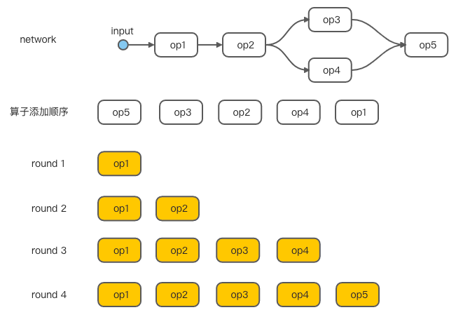

Android从8.1版本开始提供[Android Neural Network API](https://developer.android.google.cn/ndk/guides/neuralnetworks) (NNAPI)，由于它没有模型解析的接口，所以它只是一个**中层级**的API，旨在为高层级的框架（如TfLite）提供基本的功能来构建神经网络。通过NNAPI，神经网络可以运行在CPU上，也可以通过HAL运行在专用加速器（如NPU）上。总结来说AndroidNN由TfLite、NNAPI和HAL构成整个执行流程，系统架构如下图：


> 通过自定义TfLite delegate可以直接调用NPU的接口，这样就绕过了AndroidNN。

# NNAPI接口使用
在深入NNAPI的实现原理和细节前有必要了解下一些基本概念和接口使用方法。NNAPI使用ANeuralNetworksModel来表示神经网络模型；使用ANeuralNetworksCompilation来表示编译，用来对模型进行设备选择、缓存配置等；使用ANeuralNetworkMemory表示内存缓冲区，用来传输张量数据；使用ANeuralNetworksExecution来表示执行，可以是同步执行或者是异步执行。另外，在NNAPI中Operation表示算子，Operand操作数表示数据，也即常说的Tensor张量。基本的编程流程如下图：


NNAPI提供C/C++接口，当然C++接口只是对C接口的封装，下面通过对接口的调用来了解NNAPI的编程流程，完整示例请参考[官网](https://developer.android.google.cn/ndk/guides/neuralnetworks)，也可以参考[此示例](https://github.com/android/ndk-samples/blob/main/nn-samples/basic/README.md)：

1. 首先是定义神经网络模型。创建ANeuralNetworksModel空模型，然后使用ANeuralNetworksModel_addOperation()和ANeuralNetworks_addOperand()分别添加算子和数据到模型中：

   ```c++
   // 创建模型
   ANeuralNetworksModel* model = NULL;
   ANeuralNetworksModel_create(&model);
   
   // 添加数据
   ANeuralNetworksOperandType tensor3x4Type;
   tensor3x4Type.type = ANEURALNETWORKS_TENSOR_FLOAT32;
   tensor3x4Type.scale = 0.f;
   tensor3x4Type.zeroPoint = 0;
   tensor3x4Type.dimensionCount = 2;
   uint32_t dims[2] = {3, 4};
   tensor3x4Type.dimensions = dims;
   ANeuralNetworksModel_addOperand(model, &tensor3x4Type);
   
   // 添加算子
   uint32_t addInputIndexes[3] = {1, 0, 2};
   uint32_t addOutputIndexes[1] = {4};
   ANeuralNetworksModel_addOperation(model, ANEURALNETWORKS_ADD, 3, addInputIndexes, 
                                     1, addOutputIndexes);
   
   // 指定输入、输出
   uint32_t modelInputIndexes[1] = {0};
   uint32_t modelOutputIndexes[1] = {6};
   ANeuralNetworksModel_identifyInputsAndOutputs(model, 1, modelInputIndexes,
                                                 1, modelOutputIndexes);
   
   // 最终，需要表明模型定义完成
   ANeuralNetworksModel_finish(model);
   ```

2. 接下来是定义编译相关配置。创建ANeuralNetworksCompilation编译实例，并设置编译偏好设置：

   ```c++
   // 创建编译
   ANeuralNetworksCompilation* compilation;
   ANeuralNetworksCompilation_create(model, &compilation);
   
   // 设置偏好[可选]
   ANeuralNetworksCompilation_setPreference(compilation, ANEURALNETWORKS_PREFER_LOW_POWER);
   
   // 设置cache缓存[可选]
   ANeuralNetworksCompilation_setCaching(compilation, cacheDir, token);
   
   // 最终，表明编译定义完成
   ANeuralNetworksCompilation_finish(compilation);
   ```

3. 最后是执行神经网络。创建ANeuralNetworksExecution执行实例，设置网络的输入、输出，最后执行计算：

   ```c++
   // 创建执行
   ANeuralNetworksExecution* run1 = NULL;
   ANeuralNetworksExecution_create(compilation, &run1);
   
   // 设置输入、输出
   float32 myInput[3][4] = { ...the data... };
   ANeuralNetworksExecution_setInput(run1, 0, NULL, myInput, sizeof(myInput));
   
   float32 myOutput[3][4];
   ANeuralNetworksExecution_setOutput(run1, 0, NULL, myOutput, sizeof(myOutput));
   
   // 执行计算
   ANeuralNetworksEvent* run1_end = NULL;
   ANeuralNetworksExecution_startCompute(run1, &run1_end);
   
   // 等待执行完成
   ANeuralNetworksEvent_wait(run1_end);
   ANeuralNetworksEvent_free(run1_end);
   ANeuralNetworksExecution_free(run1);
   ```

实际上，一般我们不会直接调用NNAPI来推理模型，而是通过TfLite的NNAPI delegate来调用AndroidNN。

# Model的实现
AndroidNN的源代码可以从[这里](https://android.googlesource.com/platform/frameworks/ml/)找到，NNAPI提供的C/C++接口声明在nn/runtime文件夹下，NeuralNetworks.h中是C接口声明，NeuralNetworksWrapper.h中是C++接口声明，其实是C接口的封装，NeuralNetworksExtensions.h中是扩展的C接口声明，NeuralNetworksWrapperExtensions.h中是扩展的C++接口声明，NeuralNetworksOEM.h中也是扩展的声明，不过现在已经废弃，不建议使用。接口的实现代码在nn/runtime/NeuralNetworks.cpp文件中，从代码中可以看到Model相关接口（ANeuralNetworksModel_xxx）的实现是通过内部调用ModelBuilder类来完成的。类似的，Compilation相关接口实现由CompilationBuilder类来完成，Execution接口由ExecutionBuilder类完成。下面就详细介绍ModelBuilder类的实现。

​    ModelBuilder类中有许多成员方法，其中的一些方法比较重要，值得好好理解：

- addOperand和addOperation方法分别用来添加操作数和算子到模型中。ModelBuilder中有两个成员变量mOperands（std::vector<Operand>类型）和mOperations（std::vector<Operation>类型）用来存储操作数和算子。addOperand函数就是添加Operand实例到mOperands中：

  ```c++
  mOperands.push_back({
      .type = operandType,
      .dimensions = std::vector<uint32_t>(...),
      .scale = type.scale,
      .zeroPoint = type.zeroPoint,
      .lifetime = Operand::LifeTime::TEMPORARY_VARIABLE,
      .location = {.poolIndex = 0, .offset = 0, .length = 0},
      .extraParams = {},
  });
  ```

  可以看到存储的是张量的信息如数据类型type、数据维度dimensions、量化参数scale和zeroPoint    等，而不是张量的数据。lifetime用来表示操作数的生命周期，后面有重要作用。addOperation函数是添加Operation实例到mOperations中：

  ```c++
  mOperations.push_back({
      .type = operationType,
      .inputs = std::vector<uint32_t>(inputs, inputs + inputCount),
      .outputs = std::vector<uint32_t>(outputs, outputs + outputCount),
  });
  ```

  添加算子的接口只有addOperation一个，不同的算子通过operationType枚举值来分别，inputs和outputs表示算子的输入、输出操作数在mOperands的下标。

- 对于神经网络中训练好的常量数据如权重和偏差可以使用setOperandValue和setOperandValueFromMemory方法来为操作数设置数据。当数据较小时（小于128字节）会将数据拷贝到mSmallOperandValues变量中，否则用mLargeOperandValues来存储数据信息，在finish函数中执行拷贝数据操作：

  ```c++
  int ModelBuilder::setOperandValue(uint32_t index, const void* buffer, size_t length) {
      ...
      Operand& operand = mOperands[index];
      // ANEURALNETWORKS_MAX_SIZE_OF_IMMEDIATELY_COPIED_VALUES = 128
      if (length <= ANEURALNETWORKS_MAX_SIZE_OF_IMMEDIATELY_COPIED_VALUES) {
          uint32_t existingSize = static_cast<uint32_t>(mSmallOperandValues.size());
          uint32_t extraBytes = alignBytesNeeded(existingSize, length);
          mSmallOperandValues.resize(existingSize + extraBytes + length);
          operand.lifetime = Operand::LifeTime::CONSTANT_COPY;
          operand.location = {
              .poolIndex = 0, .offset = existingSize + extraBytes, .length = length};
          memcpy(&mSmallOperandValues[operand.location.offset], buffer, length);
      } else {
          operand.lifetime = Operand::LifeTime::CONSTANT_REFERENCE;
          typedef decltype(operand.location.poolIndex) PoolIndexType;
          typedef decltype(operand.location.offset) OffsetType;
          operand.location = {.poolIndex = ~PoolIndexType(0),
                              .offset = ~OffsetType(0),
                               .length = length};
          mLargeOperandValues.push_back(LargeValue{.operandIndex = index, .buffer = buffer});
      }
  }
  ```

- 接着我们还需要指定模型输入、输出的操作数，由identifyInputsAndOutputs函数来实现。除了分别使用mInputIndexes和mOutputIndexes记录输入、输出操作数在mOperands中的下标，还要修改操作数的lifetime：

  ```c++
  int ModelBuilder::identifyInputsAndOutputs(uint32_t inputCount, const uint32_t* inputs,
                                             uint32_t outputCount, const uint32_t* outputs) {
      ...
      auto setArguments = [&](std::vector<uint32_t>* indexVector, 
                              uint32_t indexCount, const uint32_t* indexList, 
                              Operand::LifeTime lifetime) -> bool {
          indexVector->resize(indexCount);
          for (uint32_t i = 0; i < indexCount; i++) {
              const uint32_t operandIndex = indexList[i];
              (*indexVector)[i] = operandIndex;
              Operand& operand = mOperands[operandIndex];
              operand.lifetime = lifetime;
          }
          return true;
      };
  
      setArguments(&mInputIndexes, inputCount, inputs, Operand::LifeTime::SUBGRAPH_INPUT);
      setArguments(&mOutputIndexes, outputCount, outputs, Operand::LifeTime::SUBGRAPH_OUTPUT);
  }
  ```

- 最终通过finish函数完成模型的定义，此后再添加算子或操作数都是无效的。在finish方法中主要做了两件事：一是拷贝在setOperandValue方法中标记为LargeValue的数据到共享内存：

  ```c++
  int ModelBuilder::copyLargeValuesToSharedMemory() {
      size_t poolSize = 0;
      // 计算数据大小
      for (LargeValue& l : mLargeOperandValues) {
          Operand& operand = mOperands[l.operandIndex];
          poolSize += alignBytesNeeded(poolSize, operand.location.length);
          operand.location.offset = poolSize;
          poolSize += operand.location.length;
      }
  
      int n;
      // 创建共享内存
      std::tie(n, mLargeValueMemory) = MemoryAshmem::create(poolSize);
      uint8_t* memoryPointer = mLargeValueMemory->getPointer();
      uint32_t poolIndex = mMemories.add(mLargeValueMemory.get());
      // 拷贝数据到共享内存
      for (LargeValue& l : mLargeOperandValues) {
          Operand& operand = mOperands[l.operandIndex];
          operand.location.poolIndex = poolIndex;
          memcpy(memoryPointer + operand.location.offset, l.buffer, operand.location.length);
      }
  }
  ```

  第二件事是根据算子的执行顺序将算子排序。我们使用addOperation来添加算子，添加的顺序是任意的，不一定是按照执行顺序来添加的，因此需要进行排序。顺便一提，在某些推理框架中如ncnn是根据输出节点来递归执行的，当然这可能会造成栈溢出问题。首先是找到已经准备好执行的算子，即算子的所有输入operand是常数或者是模型输入等，这可以通过operand操作数的lifetime来判断。我们说一个算子准备好了执行（ReadyToRun），是指在执行该算子时它的所有输入operand都已经有数据了，这样就可以实现按照算子的执行顺序来排序。

  ```c++
  // 存储准备好运行的算子index
  std::vector<uint32_t> opsReadyToRun;
  // 存储排序好的算子
  std::vector<Operation> runOrder;
  // 存储operation和它的输入operand的index键值对
  std::multimap<uint32_t, uint32_t> operandToOperations;
  // 存储算子未准备好的输入operand数量
  std::vector<uint32_t> unknownInputCount(operationCount());
  for (uint32_t operationIndex = 0; operationIndex < operationCount(); operationIndex++) {
      uint32_t& count = unknownInputCount[operationIndex];
      count = 0;
      // 遍历算子所有的输入，根据operand的lifetime来判断操作数的类型
      for (uint32_t operandIndex : mOperations[operationIndex].inputs) {
          auto lifetime = mOperands[operandIndex].lifetime;
          if (lifetime == Operand::LifeTime::TEMPORARY_VARIABLE ||
              lifetime == Operand::LifeTime::SUBGRAPH_OUTPUT) {
                  count++;
                  operandToOperations.insert(
                          std::pair<uint32_t, uint32_t>(operandIndex, operationIndex));
          }
      }
      // 如果未准备好的输入operand数量为0，则该算子已经准备好执行了
      if (count == 0) {
          opsReadyToRun.push_back(operationIndex);
      }
  }
  ```

  接下来就是遍历opsReadyToRun列表将算子放入runOrder实现算子排序了：

  ```c++
  while (opsReadyToRun.size() > 0) {
      int opIndex = opsReadyToRun.back();
      opsReadyToRun.pop_back();
      const Operation& operation = mOperations[opIndex];
      // 存入准备好的算子
      runOrder.push_back(mOperations[opIndex]);
      // 将算子的输出operand对应的算子的未准备好输入operand数量-1
      for (uint32_t operandIndex : operation.outputs) {
          auto range = operandToOperations.equal_range(operandIndex);
          for (auto i = range.first; i != range.second; i++) {
              uint32_t& count = unknownInputCount[i->second];
              // 如果未准备好的输入operand数量为0，则该算子已经准备好执行了
              if (--count == 0) {
                  opsReadyToRun.push_back(i->second);
              }
          }
      }
  }
  ```

  流程简要地概括如下图:

  

- ModelBuilder类中还有一个重要的partitionTheWork函数来对网络进行分段。该函数的实现在ExecutionPlan.cpp文件中，对函数的调用在CompilationBuilder类中的finish函数中，因此在下一篇文章中再详细地介绍它。


