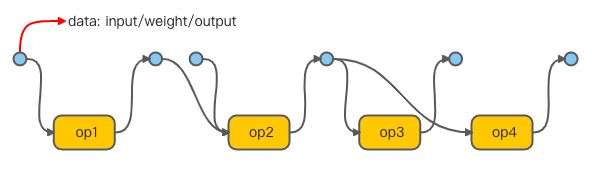

# ExecutionPlan 理解

在介绍Compilation和Execution时我们频繁的提到了ExecutionPlan类，它在两者之间起到了穿针引线的作用，在Compilation时将模型分段的信息存储在ExecutionPlan中，而在Execution时从中取出分段信息从而执行每一个子图。下面整体地介绍ExecutionPlan的设计。

在Compilation中要对模型进行分段，将神经网络分成若干子图（subgraph）使之运行在不同的设备上，分段的子图信息就存储在ExecutionPlan的mBody属性中。分段有两种情况：整张计算图运行在一种设备上，即不分段；计算图被分成多个计算子图。mBody是Body基类类型的实例，Body有两个子类SimpleBody和CompoundBody分别代表分段的两种情况。对于不分段的情况，通过调用becomeSingleStep来创建SimpleBody类型的实例mBody，此时mBody存储整张计算图；对于分段的情况会为每一个子图创建LogicalStep，有多种类型：用于非控制流算子的ExecutionStep；用于IF算子的IfStep；用于WHILE算子的WhileStep，这些step都存储在CompoundBody的mSteps变量中。

在Execution时执行算子需要根据分段信息将子图运行在相应的设备上。首先是使用ExecutionPlan的makeController方法创建了一个Controller的实例，它有两个变量：mNextStepIndex用来记录下一步该执行的LogicalStep；mFallbackNextStepIndex用来记录需要fallback的LogicalStep。开始执行，先要找到要执行的LogicalStep并取出其中的计算子图构建StepExecutor用于执行计算，由ExecutionPlan的next方法来实现：

```cpp
int ExecutionPlan::next(std::shared_ptr<Controller> controller,
                        std::shared_ptr<StepExecutor>* executor,
                        std::shared_ptr<ExecutionBurstController>* burstController,
                        const std::vector<OutputShape>* mainModelOutputShapes,
                        int syncFdOfLastStep) const {
    *executor = nullptr;

    if (mState == SIMPLE) {
        if (controller->mNextStepIndex == 0) {
            // First (and only) step.
            auto simpleBody = simple();
            *executor = std::make_shared<StepExecutor>(controller->mExecutionBuilder,
                                                       simpleBody->mModel, simpleBody->mDevice,
                                                       simpleBody->mPreparedModel);
            controller->mFallbackNextStepIndex = 0;
            controller->mNextStepIndex = 1;
            return ANEURALNETWORKS_NO_ERROR;
        }
       // 到这里的话，模型已经执行完了
        CHECK_EQ(controller->mNextStepIndex, 1u);
        controller->mNextStepIndex = Controller::kBadStepIndex;
        return ANEURALNETWORKS_NO_ERROR;
    }

    return nextCompound(controller, executor, burstController, mainModelOutputShapes);
}
```

当模型不分段时没有LogicalStep，模型存放在SimpleBody中，开始执行时第一个StepExecutor接收整张计算图，下一个StepExecutor为空表明模型执行结束。当模型分段时会有多个计算子图，存储在CompoundBody的mSteps变量中，如果模型中没有控制流算子的话在Compilation时每一个计算子图是按照执行顺序添加到mSteps中的，因此mNextStepIndex自增就可以了；如果是控制流算子如IF，则需要根据条件来选择下一步该执行的LogicalStep：

```cpp
int ExecutionPlan::nextCompound(...) {
    auto compoundBody = compound();
    const auto& logicalStep = compoundBody->mSteps[controller->mNextStepIndex];
    if (const ExecutionStep* step = logicalStep->tryExecutionStep()) {
        *executor = std::make_shared<StepExecutor>(controller->mExecutionBuilder,
                                                   step->getStepModel(),
                                                   step->getDevice(),
                                                   step->getPreparedStepModel(),
                                                   step,
                                                   &controller->mDynamicTemporaries);
        controller->mFallbackNextStepIndex = controller->mNextStepIndex;
        // 简单自增
        controller->mNextStepIndex++;
    } else if (const IfStep* step = logicalStep->tryIfStep()) {
        // 条件判断
        controller->mNextStepIndex = condValue ? step->thenStepIndex : step->elseStepIndex;
        ...
    }
}
```

至此，ExecutionPlan很好地完成了它的使命！

# Memory的管理
数据的读写与传递是一件至关重要的事，减少数据的大量拷贝能有效地降低时间消耗。数据的操作涉及到权重、偏好数据(bias)、加速器设备数据与runtime数据的交互等，接下来介绍数据处理流程。

设置权重与偏好的数据除了通过setOperandValue函数从缓冲中读取外，还可以使用setOperandValueFromMemory从内存中读取，至于内存中的数据是可以使用createFromFd从文件中，使用createFromAHardwareBuffer从原生硬件缓冲区中来读取的。从内存中读取的数据存储在ModelBuilder类的mMemories变量中。在执行计算时需要设置输入输出的数据，也可以使用setInputFromMemory、setOutputFromMemory从内存中读取，数据分别保存在ExecutionBuilder类的mInputs、mOutputs变量中。当在CPU上运行时会将mMemories和mInputs、mOutputs封装到std::vector<RunTimePoolInfo>类型变量，另外mInputs、mOutputs还会封装到Request类型的变量中作为计算图执行时算子的输入输出，代码如下：

```cpp
// 添加mMemories
std::vector<RunTimePoolInfo> requestPoolInfos;
for (const RuntimeMemory* mem : memories) {
    if (std::optional<RunTimePoolInfo> poolInfo = mem->getRunTimePoolInfo()) {
        requestPoolInfos.emplace_back(*poolInfo);
    }
}

auto fixPointerArguments = (...) {
    requestPoolInfos.emplace_back(...);
}
// 添加mInputs、mOutputs
fixPointerArguments(inputs);
fixPointerArguments(outputs);

Request request;
request.inputs = fn(inputs);
request.outputs = fn(outputs)
```

示意如下图：



在加速器上运行也类似，在编译模型时会调用ModelBuilder类中的makeModel方法将模型转换成Model类型的实例，主要做的就是将模型中的数据复制到实例中，权重等保存在pools变量中：

```cpp
Model model;
model.main = makeSubgraph(mainModel);
model.referenced = std::move(mRefSubgraphs);
model.operandValues = std::move(mOperandValues);
model.pools.resize(mMemories.size());
...
std::transform(mMemories.begin(), mMemories.end(), model.pools.begin(),
    [](const RuntimeMemory* m) { return uncheckedConvert(m->getHidlMemory()); });
...
```

这样就可以将Model实例传递到hal的IPreparedModel类中然后读取实例中的算子和权重信息构建计算图。在执行时只需要输入、输出信息就可以了，因此将Request实例传递给IPreparedModel类的execute函数。

# Device的选择
AndroidNN提供了一些设备相关的API，如ANeuralNetworks_getDeviceCount、ANeuralNetworks_getDevice，ANeuralNetworksDevice_getName等，通过这些接口我们可以获取设备的信息以及指定模型运行在哪个加速器上。跟设备有关的有两个类：Device、DeviceManager，Device有两个子类CpuDevice和DriverDevice分别代表CPU设备和加速器设备，这两个类主要通过成员函数来提供设备信息；DeviceManager用来管理设备，可以加载、注册加速器设备，只有一个实例。

设备可以提供以下的一些信息：1. 名称。CPU设备的名称是nnapi-reference，加速器设备的名称是hal层注册service时的名称；2. 支持的扩展；3. performance，以CPU为基准，所以CPU设备的performance都为1；4. 设备类型，CPU、GPU或者ACCELERATOR等；5. 支持的算子。加速器设备的信息是通过hal层的接口来提供的，在DriverDevice类中使用VersionedIDevice类来调用。

在DeviceManager中主要是将CPU设备和加速器设备都注册到设备列表中，加速器设备是通过getService接口来获取服务端的设备实例的：

```cpp
void DeviceManager::findAvailableDevices() {
    const auto names = hardware::getAllHalInstanceNames(V1_0::IDevice::descriptor);
    for (const auto& name : names) {
        const HalDeviceFactory makeDevice = [name](bool blocking) {
            return blocking ? V1_0::IDevice::getService(name) : V1_0::IDevice::tryGetService(name);
        };
        registerDevice(name, makeDevice);
    }

    // register CPU fallback device
    mDevices.push_back(CpuDevice::get());
}
```

在模型分段时有介绍到设备，但是如果用户没有指定设备信息的话，模型分段默认是考虑所有设备的，当然我们可以通过接口指定模型运行的设备。你可以使用ANeuralNetworksCompilation_createForDevices来指定设备而不是之前的ANeuralNetworksCompilation_create创建编译实例。当指定设备后如果CPU设备不在指定设备中，那么在编译或者运行中出现错误是不支持fallback到CPU上的。

