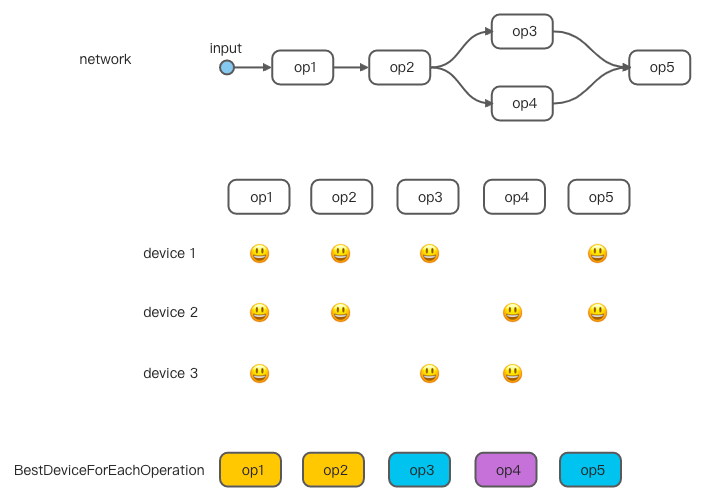
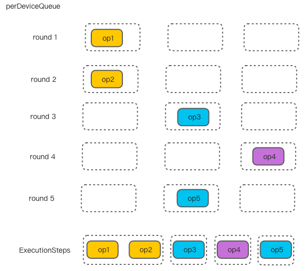
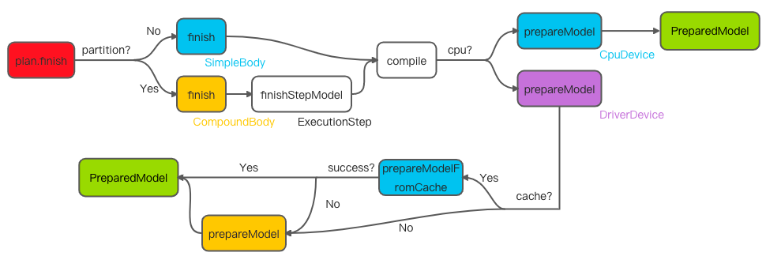

# 模型编译的流程
构建完模型的下一步就是通过CompilationBuilder来进行编译，在这一步会根据选择的设备对计算图进行子图划分并将每一个子图进行编译。这里所说的模型编译是相对于加速器设备来说的，如果模型只运行在CPU上是没有编译需要的，因为AndroidNN中不对神经网络进行图优化，那么只要遍历模型中的算子列表依次执行就可以了。但是对于加速器来说一般会对计算图进行转换和优化，即从AndroidNN IR到加速器的IR。由于加速器对计算图转换、优化一般会耗费大量的时间，甚至比模型执行时间都长，因此在编译选项中可以设置使用cache缓冲，这样只需要编译一次，在以后的运行中都可以使用已经编译好的IR。

在CompilationBuilder类中大部分的函数是设置编译选项，真正的功能实现是在finish方法中。首先是调用ModelBuilder的partitionTheWork方法来进行子图划分。第一步是为每一个算子寻找最佳的执行设备（findBestDeviceForEachOperation方法）：根据设备对算子的支持情况来找到算子的执行设备列表，然后根据每个设备的表现（performance）选择performance最好的设备。performance是根据用户设置和设备性能来决定的

```cpp
float ModelBuilder::getPerformance(uint32_t preference,
                                   const std::shared_ptr<Device> device) const {
    float perf = 0;
    const size_t operationCount = mOperations.size();
    for (size_t operationIndex = 0; operationIndex < operationCount; operationIndex++) {
        perf += getPerformance(preference, device, operationIndex);
    }
    return perf;
}

float ModelBuilder::getPerformance(uint32_t preference, const std::shared_ptr<Device> device,
                                   uint32_t operationIndex) const {
    auto applyPreference = [preference](const Capabilities::PerformanceInfo& perf) {
        return preference == ANEURALNETWORKS_PREFER_LOW_POWER ? perf.powerUsage : perf.execTime;
    };

    const Operation& operation = getOperation(operationIndex);

    if (operation.type == OperationType::IF) {
        ...
    }

    if (operation.type == OperationType::WHILE) {
        ...
    }

    const uint32_t operandIndex = operation.inputs[0];
    const OperandType operandType = mOperands[operandIndex].type;

    return applyPreference(device->getPerformance(operandType));
}
```

性能使用电量使用量（powerUsage）和执行时间（execTime）来衡量，因此越小越好，因此在选择执行设备时会以这两个变量作为基准：

```cpp
int ModelBuilder::findBestDeviceForEachOperation(
        uint32_t preference, const std::vector<std::shared_ptr<Device>>& devices,
        std::vector<int>* bestDeviceForOperation) const {
    const MetaModel metaModel(makeModel(), DeviceManager::get()->strictSlicing());

    const size_t deviceCount = devices.size();
    std::vector<CanDo> canDo(deviceCount);
    for (size_t deviceIndex = 0; deviceIndex < deviceCount; deviceIndex++) {
        // 获取设备支持算子列表
        canDo[deviceIndex].initialize(metaModel, devices[deviceIndex]);
    }

    const size_t operationCount = mOperations.size();
    for (size_t operationIndex = 0; operationIndex < operationCount; operationIndex++) {
        const Operation& operation = getOperation(operationIndex);
        int bestChoice = -1;

        float bestPerfVal = 0.0;
        for (size_t deviceIndex = 0; deviceIndex < deviceCount; deviceIndex++) {
            const auto& device = devices[deviceIndex];
            if (canDo[deviceIndex].check(operationIndex)) {
								// 根据performance选择设备，perf相同优先选择CPU设备
                const float perfVal = getPerformance(preference, device, operationIndex);
                if (bestChoice < 0 || perfVal < bestPerfVal ||
                    (perfVal == bestPerfVal && device == DeviceManager::getCpuDevice())) {
                        bestChoice = deviceIndex;
                        bestPerfVal = perfVal;
                }
            }
        }
    (*bestDeviceForOperation)[operationIndex] = bestChoice;
    return ANEURALNETWORKS_NO_ERROR;
}
```

首先是查找算子能够运行在哪些设备上，接着是查找哪个设备执行算子表现最好。算子表现(performance)是相对于CPU实现来说的，其他设备算子的表现会在其HAL实现中指定。大概流程归纳如下图：



接下来是根据算子的执行设备进行计算图的划分。在CompilationBuilder类中有一个ExecutionPlan类型的成员变量mPlan，它记录着子图划分的信息。当所有算子都在同一个设备上执行时就无需划分子图，使用ExecutionPlan的becomeSingleStep方法将整张计算图作为参数创建SimpleBody实例mBody。如果有多个子图就需要为每个子图创建ExecutionStep（如果算子是控制流算子就创建IfStep或WhileStep），首先来看如何划分子图并创建ExecutionStep。原理是将在同一设备上运行的连续相邻算子添加到一个ExecutionStep中，具体做法是：为每一个device设备创建算子队列，根据算子执行顺序和执行的设备将其放入相应的队列中，遍历队列、创建ExecutionStep实例并将算子添加到实例中，核心代码如下

```cpp
std::vector<std::queue<uint32_t>> perDeviceQueue(deviceCount + 1);
// 添加算子到相应设备的算子列表中
auto enqueueOnAppropriateDevice = [&](uint32_t operationIndex) {
    int deviceIndex = bestDeviceForOperation[operationIndex];
    perDeviceQueue[deviceIndex].push(operationIndex);
};
// 寻找下次处理的设备
auto findNextDeviceToProcess = [&]() -> int {
    for (int i = perDeviceQueue.size() - 1; i >= 0; i--) {
        if (!perDeviceQueue[i].empty()) {
            return i;
        }
    }
    return -1;
};
OperandTracker tracker(this, enqueueOnAppropriateDevice);
while (true) {
    int deviceIndex = findNextDeviceToProcess();
    auto& queue = perDeviceQueue[deviceIndex];
    ExecutionStep* step =
        plan->createNewExecutionStep(sourceModelIndex, devices[deviceIndex]);
    while (!queue.empty()) {
        uint32_t operationIndex = queue.front();
        queue.pop();
        // 添加算子到ExecutionStep中
        int n = step->addOperation(operationIndex);
				// 寻找能被添加到该ExecutionStep中的下一个算子
        tracker.markProcessed(operationIndex, enqueueOnAppropriateDevice);
    }
}
```

下图显示了处理的流程



不管是否要划分子图，在最后都需要使用ExecutionPlan的finish方法来编译计算图。在ExecutionPlan类中有一个Body类型的成员变量mBody，Body是一个虚类，被SimpleBody和CompoundBody继承。当计算图没有划分子图时mBody的实际类型是SimpleBody，当有子图时是CompoundBody，因此上面调用becomeSingleStep时模型会存储在SimpleBody的mModel变量中，在调用createNewExecutionStep时会将每一个step都添加到CompoundBody的mSteps变量中。在finish方法中会调用到mBody具体类型的finish方法，在SimpleBody中直接调用compile函数，在CompoundBody中还需要遍历mSteps中的每一个step间接地调用compile函数。在compile中会调用相应设备的prepareModel方法，即CpuDevice和DriverDevice的方法，最终会得到编译好的模型也就是PreparedModel，这个模型可能是新编译的模型，也可能是加载的之前已经编译好的模型。正如前面所说的，CPU设备没有cache功能，因此来看加速器设备是如何选择的。如果用户设置了cache缓冲功能并且缓冲文件存在的话那么直接从缓冲文件中加载模型，否则就编译模型并且保存cache文件

```cpp
std::pair<int, std::shared_ptr<VersionedIPreparedModel>> VersionedIDevice::prepareModel(
    const ModelFactory& makeModel, ExecutionPreference preference, Priority priority,
    const std::optional<Deadline>& deadline, const std::string& cacheDir,
    const std::optional<CacheToken>& maybeToken) const {
    // 直接从cache中加载
    if (maybeToken.has_value()) {
        const auto [n, preparedModel] =
            prepareModelFromCacheInternal(deadline, cacheDir, *maybeToken);
        if (n == ANEURALNETWORKS_NO_ERROR) {
            return {n, preparedModel};
        }
    }
    // 无cache文件或从cache中加载失败的话重新编译
    const Model model = makeModel();
    return prepareModelInternal(model, preference, priority, 
                                deadline, cacheDir, maybeToken);
}
```

选择的流程如下图所示



# 模型执行的流程

一切准备就绪，该执行模型了（Execution）。AndroidNN中有多种执行方式：同步执行（computeSynchronously）、异步执行（computeAsynchronously）、突发执行（burstCompute）等。

首先来看模型不分段运行在CPU上的情况，当整个模型遇到CPU fallback时才会执行。实现代码在StepExecutor的computeOnCpuFallback方法中：第一步是通过CpuDevice的prepareModel方法来获取准备好执行的模型，即RuntimePreparedModel类型的实例；接着调用实例的execute方法执行模型。RuntimePreparedModel是一个基类，有两个子类DriverPreparedModel、CpuPreparedModel，CPU设备在调用prepareModel时创建的是CpuPreparedModel类型的实例，在执行模型时会遍历计算图中的算子并根据算子类型执行相应算子的代码：

```cpp
// 在CpuExecutor.cpp文件中
for (const auto& operation : operations) {
  switch (operation.type) {
		case OperationType::POW: {
			pow::prepare(...);
			pow::eval(...);
		} break;
		...
  }
}
```

> 在Compilation时其实已经调用过prepareModel方法，这里似乎多余。当然CPU设备没有编译过程，因此几乎没有时间开销！

接下来分为两种情况：模型不分段，可运行在CPU或者加速器设备上；如果模型分段，AndroidNN会为每一个计算子图设置一个步执行器（StepExecutor），还会额外创建一个StepExecutor用来指示模型执行情况，当子图的StepExecutor运行成功并且额外的StepExecutor为空时表明神经网络模型执行结束。因此首先是找到首次或者下一步应该执行的StepExecutor，通过ExecutionPlan的next方法来实现；如果模型不分段，则整张计算图作为一个StepExecutor

```cpp
if (mState == SIMPLE) {
  if (controller->mNextStepIndex == 0) {
    // First (and only) step.
    auto simpleBody = simple();
    *executor = std::make_shared<StepExecutor>(controller->mExecutionBuilder,
                                    simpleBody->mModel, simpleBody->mDevice,
                                    simpleBody->mPreparedModel);
     controller->mFallbackNextStepIndex = 0;
     controller->mNextStepIndex = 1;
     return ANEURALNETWORKS_NO_ERROR;
    }

    CHECK_EQ(controller->mNextStepIndex, 1u);  // end
    controller->mNextStepIndex = Controller::kBadStepIndex;
}
```

这样，当执行时第一个StepExecutor接收整个计算图，下一个StepExecutor为空表示模型执行结束。当模型分段时，按照执行顺序从CompoundBody的mSteps成员变量中获取ExecutionStep、IfStep或WhileStep等创建StepExecutor

```cpp
auto compoundBody = compound();
const auto& logicalStep = compoundBody->mSteps[controller->mNextStepIndex];
if (const ExecutionStep* step = logicalStep->tryExecutionStep()) {
  *executor = std::make_shared<StepExecutor>(controller->mExecutionBuilder,
                                             step->getStepModel(),
                                             step->getDevice(),
                                             step->getPreparedStepModel(),
                                             step, &controller->mDynamicTemporaries);
} else if (..){
  ...
}
```

> 还记得在Compilation模型分段时为子图创建ExecutionStep并添加到CompoundBody的mSteps中吗？此时正是调用的时机！

接下来是执行StepExecutor，分别通过调用相应设备的RuntimePreparedModel的execute方法，上面已经介绍了CpuPreparedModel的实现，下面轮到DriverPreparedModel了。DriverPreparedModel有一个VersionedIPreparedModel类型的成员变量mPreparedModel，由于AndroidNN的hal接口定义已经有多个版本，所以使用VersionedIPreparedModel类来对接口进行封装来处理版本的问题，因此在执行模型时实际上是执行相应版本的接口，如1.3版本执行execute_1_3方法。在执行时最终会调用到加速器hal实现的接口，以[ArmNN](https://github.com/ARM-software/android-nn-driver)的hal实现为例，在prepare model时创建runtime来加载优化网络，在运行模型时调用runtime的Execute方法：

```cpp
Return<V1_3::ErrorStatus> ArmnnDriverImpl::prepareArmnnModel_1_3(...) {
    ...
    // Optimize the network
    armnn::IOptimizedNetworkPtr optNet(nullptr, nullptr);
    armnn::OptimizerOptions OptOptions;

    armnn::BackendOptions gpuAcc("GpuAcc");
    OptOptions.m_ModelOptions.push_back(gpuAcc);

    optNet = armnn::Optimize(*modelConverter.GetINetwork(),
                             options.GetBackends(),
                             runtime->GetDeviceSpec(),
                             OptOptions,
                             errMessages);

    // Load it into the runtime.
    armnn::NetworkId netId = 0;
    std::string msg;
    armnn::INetworkProperties networkProperties(options.isAsyncModelExecutionEnabled(),
                                                MemorySource::Undefined,
                                                MemorySource::Undefined);
    runtime->LoadNetwork(netId, move(optNet), msg, networkProperties)
    ...
}

Return <V1_3::ErrorStatus> ArmnnPreparedModel_1_3::execute_1_3(...){
    ...
    runtime->Execute(*m_WorkingMemHandle, inputTensors, outputTensors);
    ...
}
```

AndroidNN支持突发执行（burstCompute），所谓突发执行指的是在同一个编译实例上的一系列执行，突发执行是对于加速器设备来说的，因此要支持此特性需要加速器实现相应接口。通过突发执行可以重复使用首次执行时进行的内存映射资源避免了重复的内存映射时间消耗，另外还可以通知加速器以高性能的状态执行计算。