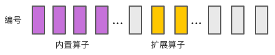
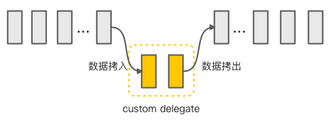

# 算子的实现
AndroidNN实现了CPU侧的计算图推理，算子的实现在/common/operations目录下。一般一个算子的实现有三个部分：validate、prepare、execute，有些算子没有validate，有些算子的execute叫做eval。下面详细介绍这三个部分。

validate表示验证算子的合法性。当调用ModelBuilder类的addOperation函数向模型中添加算子时需要使用validateOperation来验证算子是否合法，validateOperation内部就会调用各个算子的validate来验证，以ELU算子为例需要检查算子输入、输出的数量，支持的数据类型等：

```cpp
Result<Version> validate(const IOperationValidationContext* context) {
    NN_RET_CHECK_EQ(context->getNumInputs(), kNumInputs);
    NN_RET_CHECK_EQ(context->getNumOutputs(), kNumOutputs);
    auto inputType = context->getInputType(kInputTensor);
    auto minSupportedVersion = Version::ANDROID_OC_MR1;
    if (inputType == OperandType::TENSOR_FLOAT16 || inputType == OperandType::TENSOR_FLOAT32) {
        minSupportedVersion = Version::ANDROID_R;
    } else {
        NN_RET_CHECK_FAIL() << "Unsupported tensor type for operation ELU";
    }
    auto scalarType =
            inputType == OperandType::TENSOR_FLOAT16 ? OperandType::FLOAT16 : OperandType::FLOAT32;
    NN_RET_CHECK(validateInputTypes(context, {inputType, scalarType}));
    NN_RET_CHECK(validateOutputTypes(context, {inputType}));
    return minSupportedVersion;
}
```

prepare主要用来设置输出数据的信息，比如ELU算子的输出张量尺寸与输入是一致的：

```cpp
bool prepare(IOperationExecutionContext* context) {
    Shape inputShape = context->getInputShape(kInputTensor);
    return context->setOutputShape(kOutputTensor, inputShape);
}
```

execute用来执行计算。当算子是在CPU设备上执行时将调用CpuExecutor类的executeOperation函数根据算子的类型分别调用相应算子的execute执行计算，有些算子被注册到了BuiltinOperationResolver类的实例中了，这部分的算子是在switch的default分支中通过findOperation函数调用到的。注册的逻辑是这样的：首先通过`NN_REGISTER_OPERATION(ELU, "ELU", elu::validate, elu::prepare, elu::execute)`宏为ELU生成register_ELU函数；然后在BuiltinOperationResolver构造函数中调用register_ELU函数将算子添加到mRegistrations成员变量中；最后通过findOperation根据算子类型找到相应算子。说回算子实现，AndroidNN还需要根据数据的类型分别考虑，如FLOAT、UINT8等的实现：

```cpp
bool execute(IOperationExecutionContext* context) {
    switch (context->getInputType(kInputTensor)) {
        case OperandType::TENSOR_FLOAT16:
            return eluFloat(...);
        case OperandType::TENSOR_FLOAT32:
            return eluFloat(...);
        default:
            NN_RET_CHECK_FAIL() << "Unsupported tensor type for operation ELU";
    }
}
```

具体的实现需要根据算子的原理，有一些算子的实现是调用tflite里的实现

```cpp
template <typename T>
bool eluFloat(const T* inputData, const Shape& inputShape, const T alpha, T* outputData,
              const Shape& outputShape) {
    int numElements = getNumberOfElements(inputShape);
    for (int i = 0; i < numElements; ++i) {
        float x = static_cast<float>(inputData[i]);
        // y = x, if x >= 0; else y = alpha * (e_x - 1) 
        outputData[i] = static_cast<T>(std::max(0.f, x) + std::min(0.f, alpha * (std::exp(x) - 1)));
    }
    return true;
}
```

有一些算子支持UINT8、INT8运算。模型量化在深度学习中非常重要，它不仅能极大地加速模型运算还可以有效减少模型尺寸。AndroidNN中的量化计算是基于论文《[Quantization and Training of Neural Networks for Efficient Integer-Arithmetic-Only Inference](https://arxiv.org/abs/1712.05877)》，不同的算子量化方式不同，下面以矩阵相乘为例。量化值与真实值之间可以用公式$r = S * (q - Z)$来表示，r表示真实值，S表示scale，q表示量化值，Z表示zero point，那么矩阵相乘$r_3 = r_1 * r_2$可以表示为：

$$S_3(q_3^{(i,k)}-Z_3)=\sum_{j=1}^NS_1(q_1^{(i,j)}-Z_1)S_2(q_2^{(j,k)}-Z_2)$$

经过简单的变换可以得到：

$$q_3^{(i,k)}=Z_3+M\sum_{j=1}^N(q_1^{(i,j)}-Z_1)(q_2^{(j,k)}-Z_2)$$

其中

$$M=\frac{S_1S_2}{S_3}$$

上面的公式中只有M是浮点值，我们需要找到一个定点值来近似它。根据经验得到M数值在(0，1)之间，则可以表示成下面的形式

$$M=2^{-n}M_0$$

$M_0$在[0.5，1)之间，n是非负整数。以表示成int32类型数值为例，该数值就是最接近$2^{31}*M_0$的整数，因为$M_0\ge0.5$所以至少有30位的精确率。看一看卷积的实现：

```cpp
bool convNhwc(...) {
    ...
    NN_RET_CHECK(GetQuantizedConvolutionMultipler(inputShape, filterShape, biasShape, outputShape,
                                                  &real_multiplier));
    int exponent;
    NN_RET_CHECK(QuantizeMultiplier(real_multiplier, &output_multiplier, &exponent));
    output_shift = -exponent;
    CalculateActivationRangeUint8(activation, outputShape, &output_activation_min,
                                  &output_activation_max);
    ...
    tflite::optimized_ops::Conv(...);
    return true;
}
```

实际上是调用的tflite的Conv实现，不过有些参数需要计算，涉及到两个函数：GetQuantizedConvolutionMultipler就是计算M：

```cpp
TfLiteStatus GetQuantizedConvolutionMultipler(...) {
    const double input_product_scale =
        static_cast<double>(input->params.scale * filter->params.scale);
    TF_LITE_ENSURE(context, input_product_scale >= 0);
    *multiplier = input_product_scale / static_cast<double>(output->params.scale);

    return kTfLiteOk;
}
```

QuantizeMultiplier函数用来计算$M_0$和移位量n：

```cpp
void QuantizeMultiplier(double double_multiplier, int32_t* quantized_multiplier,
                        int* shift) {
    ...
    const double q = std::frexp(double_multiplier, shift);
    auto q_fixed = static_cast<int64_t>(TfLiteRound(q * (1LL << 31)));
  
    if (q_fixed == (1LL << 31)) {
      q_fixed /= 2;
      ++*shift;
    }

    if (*shift < -31) {
      *shift = 0;
      q_fixed = 0;
    }
    *quantized_multiplier = static_cast<int32_t>(q_fixed);
}
```

# 扩展的原理
Extension扩展指为AndroidNN添加新的算子或数据类型支持，它其实只是一个声明而已而非真正的实现。Extension机制是针对加速器来说的，同时AndroidNN一般是通过更高级的库如tflite来使用的，因此要完整地支持扩展需要上下游模块的协作。

定义一个扩展需要在头文件中声明扩展的信息，如扩展的名称、扩展支持的算子、数据类型，参考/extensions/example/fibonnacci下的官方示例：

```cpp
const char EXAMPLE_FIBONACCI_EXTENSION_NAME[] = "com.example.fibonacci";
enum {
    EXAMPLE_INT64 = 0,
};
enum {
    EXAMPLE_FIBONACCI = 0,
};
```

相应的，需要在加速器的hal实现接口中表明支持的扩展，在/runtime/test/fibonacci_extension/FibonacciDriver.cpp中：

```cpp
hardware::Return<void> FibonacciDriver::getSupportedExtensions(...) {
    cb(V1_0::ErrorStatus::NONE, {
        {
            .name = EXAMPLE_FIBONACCI_EXTENSION_NAME,
            .operandTypes = {
                                {
                                    .type = EXAMPLE_INT64,
                                    .isTensor = false,
                                    .byteSize = 8,
                                 }
                             },
            },
       });
    return hardware::Void();
}
```

在构建网络时使用ANeuralNetworksModel_getExtensionOperationType、ANeuralNetworksModel_getExtensionOperandType来计算算子和操作数的类型。AndroidNN支持的算子存储在枚举数据中，每个算子都有一个编号，为了让扩展算子被识别到需要也为其分配一个编号，getExtensionOperationType即是完成此功能。首先是获取Extension的prefix：

```cpp
bool TypeManager::getExtensionPrefix(const std::string& extensionName, uint16_t* prefix) {
    auto it = mExtensionNameToPrefix.find(extensionName);
    if (it != mExtensionNameToPrefix.end()) {
        *prefix = it->second;
    } else {
        *prefix = mPrefixToExtension.size();
        mExtensionNameToPrefix[extensionName] = *prefix;
    }
    return true;
}
```

接着对prefix进行移位、求或位运算：`type = (prefix << kExtensionTypeBits) | typeWithinExtension`，这样就为扩展算子分配了编号并且与内置算子区分开：



最后在hal实现中就可以根据同样的规则来识别算子的类型，从而来构建计算图：

```cpp
bool isFibonacciOperation(const V1_3::Operation& operation, const V1_3::Model& model) {
    int32_t operationType = static_cast<int32_t>(operation.type);
    uint16_t prefix;
    NN_RET_CHECK(getFibonacciExtensionPrefix(model, &prefix));
    NN_RET_CHECK_EQ(operationType, (prefix << kExtensionTypeBits) | EXAMPLE_FIBONACCI);
    return true;
}
```

# HAL的实现
[HAL](https://evilpan.com/2020/11/01/hidl-basics/)即Hardware Abstraction Layer硬件抽象层，旨在提供一套统一的接口来方便调用第三方的硬件设备，目前主要有两种实现方式：AndroidNN在Android12之前使用HIDL，在之后使用AIDL。基本原理是HAL的实现会作为服务service提供出去，客户端client接收服务并调用服务中的接口。

AndroidNN的HIDL接口定义在[1.0-1.3](https://android.googlesource.com/platform/hardware/interfaces/+/refs/heads/master/neuralnetworks/)文件夹下，AIDL接口定义在aidl文件夹下，接下来就是实现这些接口，有一些示例可供参考：HIDL实现在[sample](https://android.googlesource.com/platform/packages/modules/NeuralNetworks/+/refs/heads/master/driver/)文件夹下，AIDL实现在sample_aidl文件夹下，完整的HIDL实现可以参考[ARMNN](https://github.com/ARM-software/android-nn-driver)的实现。下面介绍HIDL实现的基本流程。

最主要的是实现IDevice类的接口并将实例使用registerAsService函数注册为服务。到1.3版本已经有大量的接口需要实现，下面介绍一些重要的：

- getCapabilities。用于获取加速器的性能数据。在模型分段时通过getPerformance方法获取算子的能力时会使用到。
- getType。获取设备的类型，有CPU、GPU、ACCELERATOR等类型。
- getSupportedOperations。获取模型中支持的算子。在模型分段时需要根据设备对算子的支持情况来进行子图划分，AndroidNN runtime将计算图传到hal层，在getSupportedOperations函数中需要遍历模型中的算子并且返回一个vector<bool>类型的结果来表示算子的支持情况。
- getNumberOfCacheFilesNeeded。获取对cache缓存的支持与否。有两种cache类型：模型缓存ModelCache、数据缓存DataCache，如果为0则表示不支持缓存。
- prepareModel。准备模型。在该函数中会根据runtime传来的子图信息来构建网络，也会编译网络，如果支持缓存的话还会将编译后的模型保存下来。
- prepareModelFromCache。从缓存中准备模型。在该函数中直接从已经编译好的模型构建网络，省去了编译的时间。
- allocate。用来拷贝数据。

重点和工作量在于prepareModel和prepareModelFromCache的实现。prepareModel和prepareModelFromCache最终都返回IPreparedModel类型的实例，在执行模型时会通过IPreparedModel类的execute方法来执行计算。首先是利用runtime传下来的子图来构建网络，以ARMNN的实现为例：

```cpp
armnn::INetworkPtr network;
armnn::IRuntime* runtime;
for (uint32_t idx = 0; idx < model.operations.size(); idx++) {
    const auto& operation = model.operations[idx];
    switch (operation.type) {
        case V1_3::OperationType::ABS:
            network->AddElementwiseUnaryLayer(...);
        case V1_3::OperationType::ADD:
            ...
    }
}
auto optNet = armnn::Optimize(network);
runtime->LoadNetwork(optNet);
```

构建、编译完网络后还可以将生成的IR作为缓存保存下来。在execute函数中执行推理：

```cpp
runtime->Execute(...);
```

prepareModelFromCache接口是从缓存中加载模型，省去了编译的时间，ARMNN暂不支持因此未实现该接口。

关于缓存cache的读写有必要详细说明一下。分配给hal的计算子图会有一个token令牌作为模型的表示来区分不同的模型，这个token在多个模块中设置：在tflite中token由四部分的哈希值组成：用户设置的字符串、子图算子、输入、输出信息；到AndroidNN的compile函数中还会附加设备信息等。但是即使这样也不足以完全区分模型，举例来说，有两个模型结构完全相同只是权重不同，那么他们的token是相同的，为了处理这种问题就需要在写入cache时在文件中添加更多的信息，如硬件的信息或者模型的哈希值等，在读取时对文件中的信息进行校验。

# tflite的接入
AndroidNN通过更高级的框架调用来间接使用，目前tflite中有NNAPI delegate来使用AndroidNN。tflite是谷歌开源的应用于移动端的深度学习推理引擎，提供delegate代理机制来允许第三方加速器厂商将模型运行在他们的设备上。

首先了解一下tflite是如何调用接口来推理模型的，在tensorflow/lite/examples/label_image/label_image.cc文件中：

```cpp
std::unique_ptr<tflite::FlatBufferModel> model;
std::unique_ptr<tflite::Interpreter> interpreter;
// 1. 读取模型
model = tflite::FlatBufferModel::BuildFromFile(model_name.c_str());
tflite::ops::builtin::BuiltinOpResolver resolver;
// 2. 创建interpreter解释器
tflite::InterpreterBuilder(*model, resolver)(&interpreter);

std::vector<uint8_t> in = ...;
// 3. 使用delegate（可选）
interpreter->ModifyGraphWithDelegate(delegate)
interpreter->AllocateTensors();

int input = interpreter->inputs()[0];
resize<int8_t>(interpreter->typed_tensor<int8_t>(input), in.data(),...);
// 4. 执行推理
interpreter->Invoke();
```

在运行时是以一个个的*TfLiteRegistration*实例进行的，当运行在CPU上时那么每一个算子就是一个*TfLiteRegistration*实例；当运行在delegate上时，分配给delegate的子图作为一个*TfLiteRegistration*实例。所以NNAPI delegate实现的核心就是将计算子图的构建、编译、执行功能封装成一个*TfLiteRegistration*实例，在/lite/delegates/nnapi/nnapi_delegate.cc中：

```cpp
static const TfLiteRegistration nnapi_delegate_kernel = {
    .init = [](...) -> void* {
        ...
        // 初始化
        NNAPIDelegateKernel* kernel_state =
            delegate_data->MaybeGetCachedDelegateKernel(params);
        ....
    },
    .free = [](...) -> void {
        // 资源清理
        delete reinterpret_cast<NNAPIDelegateKernel*>(buffer);
    },
    .prepare = [](...) -> TfLiteStatus {
        // 计算图构建
        NNAPIDelegateKernel* state =
            reinterpret_cast<NNAPIDelegateKernel*>(node->user_data);
        return state->Prepare(context, node, nnapi_errno);
    },
    .invoke = [](...) -> TfLiteStatus {
        // 执行计算图
        NNAPIDelegateKernel* state =
            reinterpret_cast<NNAPIDelegateKernel*>(node->user_data);
        return state->Invoke(context, node, nnapi_errno);
    },
    ...
};
```

主要是实现*TfLiteRegistration*的init、free、prepare、invoke字段，具体由NNAPIDelegateKernel类来完成。

第三方厂商也可以实现自己的delegate，tflite提供了一些接口来方便实现。需要实现DelegateCreate、DelegateDelete两个接口函数用于创建、销毁delegate，具体功能需要继承两个类：*SimpleDelegateInterface、SimpleDelegateKernelInterface。SimpleDelegateInterface*子类用于提供delegate的信息如名称、算子支持情况等，还用于提供*SimpleDelegateKernelInterface*子类实例；*SimpleDelegateKernelInterface*负责实现关于计算子图的一切如根据计算子图中的算子信息构建网络(init函数)、编译计算图(prepare函数)、执行计算图(eval函数)。需要提一下的是NNAPI delegate的实现方式与此不同，而hexagon delegate就是这种实现方式，可以用作参考。tflite使用bazel编译系统，第三方delegate实现可以单独建立一个仓库把tflite当做一个依赖，可以参考MTK的[neuron delegate](https://github.com/MediaTek-NeuroPilot/tflite-neuron-delegate)项目。下面详细地介绍下*SimpleDelegateKernelInterface*接口的实现。在init函数中根据分段的子图信息来构建网络，算子在params参数的nodes_to_replace中，输入、输出张量在input_tensors、output_tensors中，input_tensors不仅包括计算图的输入还包括常量值如权重、偏置量等，可以根据张量的allocation_type属性是否是kTfLiteMmapRo来判断，如果是常量则可以存储在一个全局的字典变量中，这样在后续的建图中就避免了重复的读取数据。在prepare函数中一般会进行模型编译处理，第三方厂商的设备支持特定的IR需要进行转换操作。最终在eval函数中执行模型，首先是从输入的张量中拷贝数据，接着执行完模型后还需要将输出数据拷贝出去，如下图所示：



实现完自定义delegate后还有一些工具可以用来测试模型推理的准确率和性能。要使用这些工具首先需要实现provider功能，这样可以方便地让delegate被工具调用得到，参考neuron delegate中的实现。有两个工具：inference_diff用来分析delegate相对于cpu执行的延时和数值差距，输出的结果类似下面：

```cpp
Num evaluation runs: 50
Reference run latency: avg=84364.2(us), std_dev=12525(us)
Test run latency: avg=7281.64(us), std_dev=2089(us)
OutputDiff[0]: avg_error=1.96277e-05, std_dev=6.95767e-06
```

imagenet_image_classification用于统计delegate在imagenet图片分类5万张测试图片上的top1-10的准确率，结果类似如下：

```cpp
Num evaluation runs: 300 # Total images evaluated
Preprocessing latency: avg=13772.5(us), std_dev=0(us)
Inference latency: avg=76578.4(us), std_dev=600(us)
Top-1 Accuracy: 0.733333
Top-2 Accuracy: 0.826667
Top-3 Accuracy: 0.856667
Top-4 Accuracy: 0.87
Top-5 Accuracy: 0.89
Top-6 Accuracy: 0.903333
Top-7 Accuracy: 0.906667
Top-8 Accuracy: 0.913333
Top-9 Accuracy: 0.92
Top-10 Accuracy: 0.923333
```