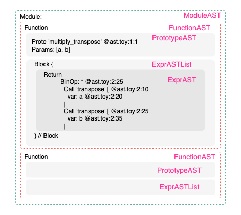

# MLIR的缘起
MLIR是什么？MLIR是一个编译器项目。在编程语言编译器方面已经有LLVM和GCC，在深度学习编译器方面有TVM，那么MLIR相比于它们有什么优点呢？以编译编程语言为例，在将代码转换到可执行指令的过程中需要对程序分析、优化以便去除冗余的计算、规划指令执行的次序等，分析、优化涉及的算法和流程经过几十年的发展都已经很成熟了，如果每种编程语言都重新实现一遍就做了重复工作，因此MLIR提供了一系列组件方便用户用来实现自己的编译器，它不仅提供了内部实现的优化策略还允许用户非常简单地实现自定义的优化方案。

MLIR可以是Mid Level、Moore’s Law、Machine Learning或者Modular Library等的缩写，深度学习领域是其重点发力的方向。随着摩尔定律的失效越来越多的领域特定处理器被开发出来，特别是AI加速器芯片如雨后春笋般蓬勃发展，而要将深度学习模型运行在这些加速器上不可避免地是对模型分析、优化，然后生成执行的指令。大名鼎鼎的TVM同样是深度学习编译器，那么与MLIR的区别在哪里？个人认为TVM的重心在于通过智能算法来生成高性能的算子实现，它可以生成运行在CPU、GPU等的代码，虽然它也提供了BYOC机制使算子执行在加速器上，但是问题是加速器也要有运行时(runtime)来执行硬件相关或无关的优化，而在这个层次上非常适合使用MLIR来完成。确实是有厂商使用TVM来实现自己加速器的运行时，但是实现颇具难度。下面以Arm的[ethos-n](https://github.com/ARM-software/ethos-n-driver-stack)项目为例看一看加速器的运行时是如何使用的，值得一提的是ethos-n项目对深度学习模型分析、优化是自己实现的，从源码中可以发现实现起来不仅麻烦而且工作量巨大，在后续的文章中会了解使用MLIR竟会如此简单。

```cpp
// 构建计算图
std::shared_ptr<ethosn_lib::Network> net = ethosn_lib::CreateNetwork();
// 添加算子
ethosn_lib::AddInput(net, ...);
ethosn_lib::AddRelu(net, ...);
ethosn_lib::AddConvolution(net, ...);
...
// 编译网络，得到IR
std::vector<std::unique_ptr<CompiledNetwork>> compiled_net = ethosn_lib::Compile(net, ...);
std::vector<char> compiled_net_data;
ethosn::utils::VectorStream compiled_net_stream(compiled_net_data);
compiled_net[0]->Serialize(compiled_net_stream);
// 运行网络
std::unique_ptr<ethosn::driver_library::Network> runtime_net = 
                std::make_unique(compiled_net_data.data(), compiled_net_data.size());
runtime_net->ScheduleInference(...);
```

MLIR当然不仅如此，在其他领域也同样可以大展拳脚，如微软开源的编程语言[Verona](https://github.com/microsoft/verona)、硬件设计工具[CIRCT](https://github.com/llvm/circt)都使用MLIR来优化代码。MLIR中有许多概念，对于非编译器领域的从业者、研究者来说会非常困惑，虽然官网文档已经做了详细的说明但是读完如坠五里雾中，后续系列文章将通过Toy案例来逐渐解析。

# Toy初步
为了让研究者更快地了解MLIR中的概念，MLIR项目通过发明一种新的编程语言Toy来一步步地揭开Dialect、Pass、Interface的奥秘，最终我们不仅能创建新的数据类型还可以生成实际运行的代码。下面对Toy语言做个简单的介绍。

## Toy语法
为了简单起见，Toy语言只支持有限的特性，如数据都是`double`类型的；只支持基本的算数运算；只支持几个内置函数等，通过下面的代码来一窥究竟：

```python
def main() {
  var a = [[1, 2, 3], [4, 5, 6]];

  var b<2, 3> = [1, 2, 3, 4, 5, 6];

  print(transpose(a) * transpose(b));
}
```

使用`def`定义函数；使用`var`定义变量；变量a是一个张量，它的shape没有指定可以从字面值中推断出来；而变量b指定了shape，如果跟字面值不符会进行reshape操作；内置函数`transpose`对张量执行转置操作，内置函数`print`打印结果到控制台；不要忽略`*`是逐元素相乘的操作符。Toy还支持自定义函数的调用，函数参数的shape没有指定，会在实际调用时确定：

```python
// ast.toy
# 定义一个函数，参数的shape未指定
def multiply_transpose(a, b) {
  return transpose(a) * transpose(b);
}

def main() {
  var a = [[1, 2, 3], [4, 5, 6]];
  var b<2, 3> = [1, 2, 3, 4, 5, 6];
  # 输入shape是<2, 3>，输出shape是<3, 2>
  var c = multiply_transpose(a, b);
}
```

下面观察一下程序的抽象语法树AST结构。MLIR项目编译后在想`build/bin`目录下有toy示例的可执行程序，执行`./toyc-ch1 ast.toy -emit ast`得到AST：

```sh
Module:
    Function
      Proto 'multiply_transpose' @ast.toy:1:1
      Params: [a, b]
      Block {
        Return
          BinOp: * @ast.toy:2:25
            Call 'transpose' [ @ast.toy:2:10
              var: a @ast.toy:2:20
            ]
            Call 'transpose' [ @ast.toy:2:25
              var: b @ast.toy:2:35
            ]
      } // Block
    Function
      Proto 'main' @ast.toy:5:1
      Params: []
      Block {
        VarDecl a<> @ast.toy:6:3
          Literal: <2, 3>[ <3>[ 1.000000e+00, 2.000000e+00, 3.000000e+00], <3>[ 4.000000e+00, 5.000000e+00, 6.000000e+00]] @ast.toy:6:11
        VarDecl b<2, 3> @ast.toy:7:3
          Literal: <6>[ 1.000000e+00, 2.000000e+00, 3.000000e+00, 4.000000e+00, 5.000000e+00, 6.000000e+00] @ast.toy:7:17
        VarDecl c<> @ast.toy:8:3
          Call 'multiply_transpose' [ @ast.toy:8:11
            var: a @ast.toy:8:30
            var: b @ast.toy:8:33
          ]
      } // Block
```

## Toy的抽象语法树
代码本质上是字符串，为了了解代码的逻辑就需要对字符串进行分析从而得到AST抽象语法树。在`/examples/toy/Ch1`文件夹下有解析的代码，详细的实现就不赘述了，这里只简单地介绍解析的流程。一个`.toy`文件中的代码作为一个`ModuleAST`，`ModuleAST`里包含若干个`FunctionAST`。因此解析代码字符串首先以函数为单位进行解析，按照一个个的字符来遍历，当遇到`def`时开始解析函数。`FunctionAST`有`PrototypeAST`和`Block`两个子模块，分别代码函数的名称、参数列表和函数内部实现，`Block`是由一系列的表达式`ExprAST`组成的`ExprASTList`。表达式`ExprAST`有多种类型：用于定义变量的`VarDeclExprAST`；用于表示函数返回的`ReturnExprAST`；用于调用函数的`CallExprAST`等。因此上面代码的AST的结构可以概括成下图：



最后值得一提的是，在`examples`目录下还有一个`standalone`项目，该项目可以用作创建一个独立项目而把MLIR作为第三方依赖的参考。当你打算借助MLIR建立一个新编程语言项目或AI编译器项目时，将非常有帮助。