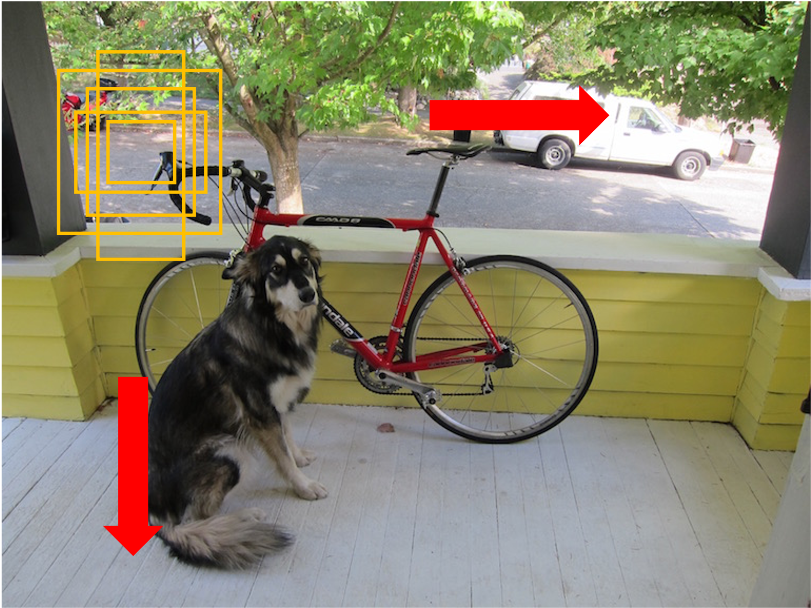
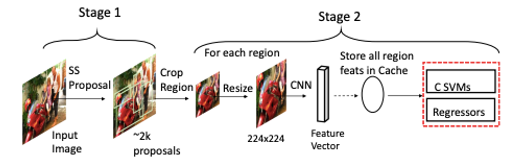
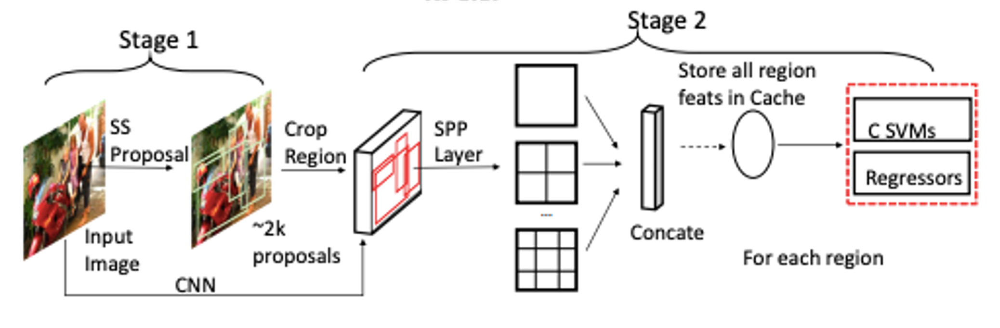
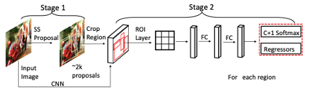

多年后人们仍会记起2012的夏天，[AlexNet](https://proceedings.neurips.cc/paper/2012/file/c399862d3b9d6b76c8436e924a68c45b-Paper.pdf)在[ILSVRC](https://image-net.org/challenges/LSVRC/2012/index.php)大赛的夺冠带来了一股热潮，一个崭新的时代要来了。在之后的ILSVRC 2012研讨会上人们进行了激烈地讨论：卷积神经网络在图片分类上取得的成果多大程度上能够应用在目标检测上。Ross Girshick的RCNN给出了他们的答案。

首先需要明确什么是目标检测，目标检测指的是识别图片中物体的正确类别并给出物体在图片中的位置，这里指的物体根据任务定义而有所不同，比如对于人脸检测物体指的是人脸，行人检测指的是行人等；还可以根据数据集的不同而有所区别，对于Pascal VOC数据集有20种物体，对于COCO数据集有80种物体，本系列文章将会介绍能适用于各种物体检测的通用算法如Faster RCNN系列、YOLO系列等，还会介绍专注于特定物体检测的算法如RetinaFace、PyramidBox等。

我们究竟该如何识别物体并且定位物体呢？在深度学习算法流行之前经常使用滑动窗(sliding window)的方式，通过不同尺寸、不同比例的窗口在图片上从左到右、从上到下滑动并使用算法识别窗口中的物体来达到定位并且识别的目的。

这种方式有着极大的缺陷。首先是滑动窗的数量极其庞大，仅仅一个尺度(scale)的窗口数量就可以达到$10^4-10^5$量级，更不用说多尺度(multi-scale)和多纵横比(aspect ratio)了；其次由于滑动窗庞大的数量导致无法使用更加复杂的物体识别算法，否则检测所需要的时间将令人难以忍受，实时检测成为永远无法企及的梦想，简单的算法又造成物体识别的准确性不尽人意；再者滑动窗无法准确地定位物体的位置，图片中物体形状、大小、位置千差万别，固定尺寸、比例的滑动窗自然无法做到准确。

# 1. RCNN

"features matter"(特征很重要)，[RCNN](https://arxiv.org/pdf/1311.2524.pdf)开篇写道。是啊，特征的确很重要！图像识别是一项复杂的任务，需要有层次的、多阶段的特征，SIFT、HOG对此捉襟见肘而AlexNet优秀的表现让人们见识到了CNN的潜力。深度网络能够提升识别的准确率但是耗时也相应增加，滑动窗庞大的数量仍然是一个障碍，那么是否能减少滑动窗的数量呢？实际上有一些算法能够生成可能包含物体的候选框(region proposal)，这些候选框的数量远小于滑动窗的数量，因此使得使用深度网络变成了可能，顺便一提，RCNN是regions with CNN features的缩写。候选框虽然是使用智能算法来生成的，但是还是无法准确地定位物体，仍需要使用回归算法(regression)来对位置进行微调。候选框、神经网络和位置回归构成了RCNN的主体，公式表示为$region+CNN+regression=RCNN$。

首先来看推理过程。RCNN使用[selective search](http://www.huppelen.nl/publications/selectiveSearchDraft.pdf)算法为每张图片生成大约2k个候选框并根据候选框的位置从图片中裁剪出来，这样就有了大约2K张图片，这些图片的大小尺寸不一而深度图片识别网络一般需要固定尺寸的输入，因此在传入网络之前需要对图片做wrap操作，也就是resize。经过深度网络提取特征后每个图片将得到4096维的向量，接着使用SVM(support vector machines, 支持向量机)对特征向量进行分类。正如前面所说的候选框的位置不够准确，RCNN使用regression回归来微调位置。由于同一个物体可能会有多个框来表示位置，因此最后使用非极大值抑制(non-maximum suppression, NMS)去除重复的框。在训练过程中同样首先要生成候选框并且wrap供分类网络提取特征，而分类网络先在ILSVRC2012数据集上预训练再在检测数据集上微调(fine-tuning)，在微调时候选框与真实样本框IoU大于等于0.5时作为正样本，否则作为负样本。在训练SVM时候选框与真实框之间IoU小于0.3则作为负样本，真实框作为正样本。训练回归器我们希望得到4个变换函数来微调候选框的位置：$d_x(P), d_y(P), d_w(P), d_h(P)$，P指候选框，根据变换函数就可以微调框的位置了：

$$
\hat{G}_x=P_xd_x(P)+P_x \\ \hat{G}_y=P_yd_y(P)+P_y \\ \hat{G}_w=P_wexp(d_w(P)) \\ \hat{G}_h=P_hexp(d_h(P))
$$

优化的目标就是最小化$\hat{G}_x,\hat{G}_y,\hat{G}_w,\hat{G}_h$和真实值$G_x,G_y,G_w,G_h$之间的距离。

# 2. SPPNet

RCNN在每张图上生成大约2k个候选框然后对每个候选框使用神经网络提取特征，这无疑是相当耗时的，2k个候选框肯定产生很多的重叠部分，对每个候选框提出特征会有大量的重复计算。此外神经网络需要固定尺寸的输入，RCNN使用wrap使得候选框中的物体产生变形非常不利于物体识别。针对这两个问题[SPPNet](https://arxiv.org/pdf/1406.4729.pdf)提出了相应的解决方案。首先针对重复计算的问题，RCNN采用`图片>生成候选框>裁取图片>提取特征`的范式，其实只要调换一下顺序先提取特征然后在特征图上裁取候选框就避免了重复计算，变成`图片>提取特征、生成候选框>裁取特征图`。针对神经网络固定输入尺寸的问题，症结在于全连接层，卷积使用滑动窗的形式计算对输入尺寸没有要求。那么怎么让全连接层的输入长度固定呢？SPPNet提出空间金字塔池化(spatial pyramid pooling, SPP)操作。原理是对裁取的特征图使用不同大小的池化，这里的池化是全局的即针对的是整个特征图，与常使用的滑动窗形式的池化不同。全局池化操作输出的大小与输入无关，如2x2的池化输出4个数(channel假设为1)，4x4的池化输出16个数，将这些池化操作的结果拼接起来就构成了全连接层的输入。

# 3. Fast RCNN

RCNN和SPPNet都是分阶段训练的，先是神经网络然后是SVM最后是回归器，[Fast RCNN](https://arxiv.org/pdf/1504.08083.pdf)做出了改进使得能够端对端(end-to-end)的训练。Fast RCNN网络前面与SPPNet一致，都是使用神经网络处理图片得到特征图，使用selective search为图片生成大约2k个候选框，接着根据候选框位置裁取特征图；接下来两者就不同了，SPPNet使用SPP来得到固定尺寸的特征，而Fast RCNN使用RoI pooling生成RoI(Region Of Interest, 感兴趣区域)，其实RoI pooling可以看作是SPP的一种特例；接着对RoI分为两个分支处理：classifier、regressor，前者使用softmax输出分类概率，后者得到位置回归系数。在训练时使用分类损失和回归损失共同优化模型：$L=L_{cls}+\lambda[u\ge1]L_{loc}$，$\lambda$是用来平衡两种损失的超参数。

