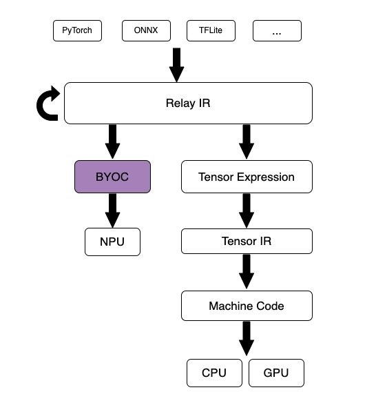
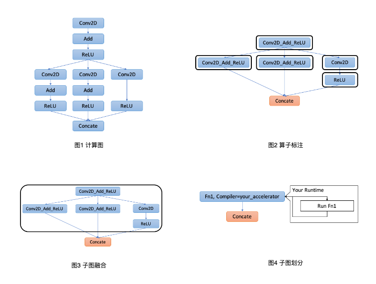

# BYOC

BYOC全称Bring Your Own Codegen，是用来添加第三方后端的一种机制。TVM支持将深度学习模型部署到CPU、GPU后端设备上，那么为了允许第三方厂商将设备对接到TVM软件栈上BYOC机制被提了出来，这里的第三方后端可以是推理框架或者AI加速器。下图是BYOC在TVM软件栈中的位置：



实现一个第三方的BYOC需要三步：子图划分、实现codegen、实现runtime，下面一一介绍。

# 子图划分

要将深度学习模型部署到第三方后端上首先就需要为计算图中的算子指定运行的设备，这涉及到算子的支持情况检查、算子模式匹配、子图划分等。下面以源代码中dnnl后端为例：现在有一个计算图，第一步需要将图中的算子进行标记表明后端是否支持，另外还可以定义一些算子匹配模式，如下图2计算图中的`Conv2D+Add+ReLU`相连的三个算子可以用后端的一个算子来表示；接下来是将相同后端的算子融合成一个大的计算子图，如图2的分散的黑框组成了图3的一个黑框；后续就是划分计算子图了，用Function类实例来表示，如图4。



代码在python层实现。首先是算子标记：通过`register_op_attr`装饰器表明某算子是否某设备支持，当然为了简单起见下面代码直接返回True，一般需要根据参数来判断是否支持。如前面所说，还支持定义一些算子匹配模式来融合算子，如dnnl后端有一个接口`DNNLConv2d(const bool has_bias = false, const bool has_relu = false)` 当参数`has_bias`和`has_relu`为真时可以表示`Conv2D+Add+ReLU`三个算子，当`has_bias`为假`has_relu`为真时可以表示`Conv2D+ReLU`两个算子。

```python
# 检查设备是否支持算子
@tvm.ir.register_op_attr("nn.conv2d", "target.dnnl")
def _dnnl_conv2d_wrapper(attrs, args):
  return True

# 定义算子匹配模式
def make_pattern(with_bias=True):
  data = wildcard()
  weight = wildcard()
  bias = wildcard()
  conv = is_op('nn.conv2d')(data, weight)
  if with_bias:
    conv_out = is_op('add')(conv, bias)
  else:
    conv_out = conv
  return is_op('nn.relu')(conv_out)

@register_pattern_table("dnnl")
def pattern_table():
  conv2d_bias_relu_pat = ("dnnl.conv2d_bias_relu", make_pattern(with_bias=True))
  conv2d_relu_pat = ("dnnl.conv2d_relu", make_pattern(with_bias=False))
  dnnl_patterns = [conv2d_bias_relu_pat, conv2d_relu_pat]
  return dnnl_patterns
```

这样如果匹配模式匹配到后就将原来的relay ir进行变换，如下所示：

```python
# 转换前
%1 = nn.conv2d(%data, %weight, ...)
%2 = add(%1, %bias)
%3 = nn.relu(%2)
# 转换后
%1 = fn(%input1, %input2, %input3,
        Composite="dnnl.conv2d_bias_relu",
        PartitionedFromPattern="nn.conv2d_add_nn.relu_") {
  %1 = nn.conv2d(%input1, %input2, ...)
  %2 = add(%1, %input3)
  nn.relu(%2)
}
%2 = %1(%data, %weight, %bias)
```

值得一提的是上面有一个`PartitionedFromPattern`的属性，它在你想匹配一个特定算子后紧跟任意类型算子模式时非常有用，比如有一个模式`("conv2d_with_something", conv2d -> *)`：

```python
def make_pattern(with_bias=True):
  data = wildcard()
  weight = wildcard()
  conv = is_op('nn.conv2d')(data, weight)
  return wildcard()(conv)
```

这样`Composite`属性值是`conv2d_with_something` ，但是这样我们无法知道`conv2d`后匹配的算子是什么，而`PartitionedFromPattern`属性的值是`nn.conv2d_add_`时我们就可以知道是`add`，当是`nn.conv2d_nn.relu_`时我们知道是`relu`。最后就是对原始的计算图进行标记、子图划分了：

```python
mod = create_relay_module_from_model() # 图 1
mod = transform.MergeComposite(pattern_table)(mod)
mod = transform.AnnotateTarget(["dnnl"])(mod) # 图 2
mod = transform.MergeCompilerRegions()(mod) # 图 3
mod = transform.PartitionGraph()(mod) # 图 4
```

其实每个后端会提供一个接口来完成上面的步骤，如dnnl的接口：

```python
def partition_for_dnnl(mod, params=None):
    if params:
        mod["main"] = bind_params_by_name(mod["main"], params)
    seq = tvm.transform.Sequential(
        [
            transform.CanonicalizeOps(),
            transform.InferType(),
            transform.SimplifyInference(),
            transform.FoldConstant(),
            transform.FoldScaleAxis(),
            # fold consecutive add ops to simplify pattern `conv2d-bias_add-bn-relu`
            transform.SimplifyExpr(),
            transform.FoldConstant(),
            transform.MergeComposite(pattern_table()),
            transform.AnnotateTarget("dnnl"),
            transform.MergeCompilerRegions(),
            transform.PartitionGraph(),
        ]
    )
    with tvm.transform.PassContext(opt_level=3):
        mod = seq(mod)
    return mod
```

# 实现codegen

codegen总的来说有两种形式：生成C代码、生成IR文件。先说第一种生成C代码的形式。有些计算库提供了高效的算子实现，我们可以通过其提供的接口来构建深度学习模型。现在要实现BYOC以便TVM能够将计算图分发到该后端上，此时如同手动调用接口一样我们让程序自动生成调用的代码。dnnl后端实现了两种形式，我们先看生成C代码的形式：

```cpp
// 注册codegen
TVM_REGISTER_GLOBAL("relay.ext.dnnl").set_body_typed(DNNLCompiler);

runtime::Module DNNLCompiler(const ObjectRef& ref) {
  DNNLModuleCodegen dnnl;
  return dnnl.CreateCSourceModule(ref);
}

class DNNLModuleCodegen : public CSourceModuleCodegenBase {
 public:
  std::pair<std::string, Array<String>> GenDNNLFunc(const Function& func) {
    auto sid = GetExtSymbol(func);
    CodegenDNNL builder(sid);
    auto out = builder.VisitExpr(func->body);
    code_stream_ << builder.JIT(out);

    return {sid, builder.const_vars_};
  }
  // 生成C代码
  runtime::Module CreateCSourceModule(const ObjectRef& ref) override {
    // 导入头文件的代码
    code_stream_ << "#include <cstdint>\n";
    ...
    code_stream_ << "using namespace tvm::runtime::contrib;\n";
    code_stream_ << "\n";

    ICHECK(ref->IsInstance<FunctionNode>());
    // 根据模型定义调用相应的接口
    auto res = GenDNNLFunc(Downcast<Function>(ref));
    std::string code = code_stream_.str();
    String sym = std::get<0>(res);
    Array<String> variables = std::get<1>(res);
    // 使用编译器编译C代码
    const auto* pf = runtime::Registry::Get("runtime.CSourceModuleCreate");
    return (*pf)(code, "c", Array<String>{sym}, variables);
  }
}
```

首先是注册codegen用于模型编译。在CreateCSourceModule函数中生成函数调用的C代码，可以看到与我们手动调用接口实现模型一样：要导入头文件；要根据计算图的结构调用相应的接口等。最后生成的代码要经过编译器编译后然后在部署时直接调用即可，下面是一个生成的C代码示例：

```cpp
#include <cstdint>
#include <cstdlib>
#include <cstring>
#include <vector>
#include <tvm/runtime/c_runtime_api.h>
#include <tvm/runtime/container.h>
#include <tvm/runtime/packed_func.h>
#include <dlpack/dlpack.h>
#include <dnnl/dnnl_kernel.h>
using namespace tvm::runtime;
using namespace tvm::runtime::contrib;

// Execute the conv2d->add->relu graph with DNNL.
extern "C" void dnnl_0_(float* dnnl_0_i0, float* dnnl_0_i1,
                        float* dnnl_0_i2, float* out0) {
  // Allocate intermediate buffers.
  float* buf_0 = (float*)std::malloc(4 * 4608);
  float* buf_1 = (float*)std::malloc(4 * 4608);
  float* buf_2 = (float*)std::malloc(4 * 4608);

  // Pre-implemented op-based DNNL functions.
  dnnl_conv2d(dnnl_0_i0, dnnl_0_i1, buf_0, 1, 32, 14, 14, 32, 1, 0, 0, 3, 3, 1, 1);
  dnnl_add(buf_0, dnnl_0_i2, buf_1, 1, 32, 12, 12);
  dnnl_relu(buf_1, buf_2, 1, 32, 12, 12);

  // Copy the final output to the corresponding buffer.
  std::memcpy(out0, buf_2, 4 * 4608);
  std::free(buf_0);
  std::free(buf_1);
  std::free(buf_2);
}

// The wrapper function with all arguments in DLTensor type.
extern "C" int dnnl_0_wrapper_(DLTensor* arg0,
        DLTensor* arg1,
        DLTensor* arg2,
        DLTensor* out0) {

  // Cast all DLTensor to primitive type buffers and invoke the above
  // execution function.
  dnnl_0_(static_cast<float*>(arg0->data),
  static_cast<float*>(arg1->data),
  static_cast<float*>(arg2->data),
  static_cast<float*>(out0->data));
  return 0;
}

// The TVM macro to generate TVM runtime compatible function "dnnl_0"
// from our generated "dnnl_0_wrapper_".
TVM_DLL_EXPORT_TYPED_FUNC(dnnl_0, dnnl_0_wrapper_);
```

由于生成C代码的方式很少使用所以介绍地不太详细，感兴趣的可以参考[官方文档](https://tvm.apache.org/docs/dev/how_to/relay_bring_your_own_codegen.html)。

接下来介绍生成IR文件的形式。第三方后端往往支持自身形式的模型表示即IR，因此在编译模型时需要将relay的IR转换到相应的IR，然后在部署时通过加载第三方的IR来解析模型、推理模型。dnnl使用Json文件来表示模型，下面来看看它的实现方式：

```cpp
runtime::Module DNNLCompiler(const ObjectRef& ref) {
  ICHECK(ref->IsInstance<FunctionNode>());
  auto func = Downcast<Function>(ref);
  auto func_name = GetExtSymbol(func);
  DNNLJSONSerializer serializer(func_name, func);
  serializer.serialize();
  // 生成Json
  std::string graph_json = serializer.GetJSON();
  auto params = serializer.GetParams();
  // 将runtime与json进行关联
  const auto* pf = runtime::Registry::Get("runtime.DNNLJSONRuntimeCreate");
  ICHECK(pf != nullptr) << "Cannot find JSON runtime module to create";
  auto mod = (*pf)(func_name, graph_json, params);
  return mod;
}
```

当然首先还是需要 注册codegen，这里生成Json使用了DNNLJSONSerializer类，该类继承自JSONSerializer类，其本质与生成C代码一样，都是使用VisitExpr来遍历计算图中的算子并分别获取算子信息，下面是一个算子的json形式信息：

```json
{
  op: "kernel",
  name: "dnnl.conv2d_relu",
  inputs: [[0, 0, 0], [1, 0, 0]],
  attrs: {
    shape: [1, 32, 14, 14],
    data_layout: ["NCHW"],
    kernel_layout: ["OIHW"],
    strides: [1, 1],
    padding: [1, 1, 1, 1]
  }
}
```

生成的json字符串需要在保存时保存到文件中，并且在部署时需要读取解析json字符串，这些接口都在runtime中实现。

# 实现runtime

最后一步是实现第三方后端的runtime，它主要负责解析、执行计算图和序列化计算图。总的来说需要实现三个接口：

1. `GetFunction`：当有计算子图要运行在第三方的后端上时TVM runtime会调用此函数，该函数返回一个推理计算图的PackedFunc函数。
2. `SaveToBinary`：在使用export_library来保存模型编译后的产物时会调用该函数，实质是序列化计算图。
3. `LoadFromBinary`：与`SaveToBinary`函数相反，该函数是要解析计算图，在模型推理时该函数将第三方的IR解析然后从而执行推理。

```cpp
// 注册runtime，在codegen中用到
TVM_REGISTER_GLOBAL("runtime.DNNLJSONRuntimeCreate").set_body_typed(DNNLJSONRuntimeCreate);
// 注册加载接口，在部署时用到
TVM_REGISTER_GLOBAL("runtime.module.loadbinary_dnnl_json")
    .set_body_typed(JSONRuntimeBase::LoadFromBinary<DNNLJSONRuntime>);

runtime::Module DNNLJSONRuntimeCreate(String symbol_name, String graph_json,
                                      const Array<String>& const_names) {
  auto n = make_object<DNNLJSONRuntime>(symbol_name, graph_json, const_names);
  return runtime::Module(n);
}
```

一般会注册runtime，这样在codegen中会调用它的`SaveToBinary` 函数来保存模型；还要注册模型加载的接口，这样才能将第三方的IR解析并运行到第三方后端上。下面是ethos-n的runtime实现：

```cpp
class EthosnModule : public ModuleNode {
  PackedFunc EthosnModule::GetFunction(const std::string& name,
                                       const ObjectPtr<Object>& sptr_to_self) {
    if (network_map_.find(name) != network_map_.end()) {
      return PackedFunc([sptr_to_self, this, name](TVMArgs args, TVMRetValue* rv) {
      *rv = Inference(args, network_map_[name].runtime_cmm.get(), network_map_[name].inputs,
                      network_map_[name].outputs);
      });
    } else {
      return PackedFunc();
    }
  }

void EthosnModule::SaveToBinary(dmlc::Stream* stream) {
  stream->Write(network_map_.size());
  for (const auto& it : network_map_) {
    stream->Write(it.first);
    std::stringstream ss;
    ICHECK(it.second.compiled_cmm != nullptr);
    it.second.compiled_cmm->Serialize(ss);
    ...
  }
}

Module EthosnModule::LoadFromBinary(void* strm) {
  auto stream = static_cast<dmlc::Stream*>(strm);
  size_t func_count;
  // Read the number of functions
  stream->Read(&func_count);
  std::vector<OrderedCompiledNetwork> cmms;
  cmms.resize(func_count);
  for (unsigned int i = 0; i < func_count; i++) {
    OrderedCompiledNetwork& compiled = cmms[i];
    ...
    stream->Read(&cmm);
    std::istringstream cmm_strm(cmm);
    compiled.compiled_cmm = sl::DeserializeCompiledNetwork(cmm_strm);
    ...
  }
  auto n = make_object<EthosnModule>(&cmms);
  return Module(n);
  }
}
```

# 参考

[How to Bring Your Own Codegen to TVM](https://tvm.apache.org/2020/07/15/how-to-bring-your-own-codegen-to-tvm)

[Bring Your Own Codegen To TVM](https://tvm.apache.org/docs/dev/how_to/relay_bring_your_own_codegen.html)