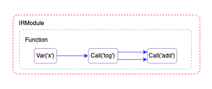
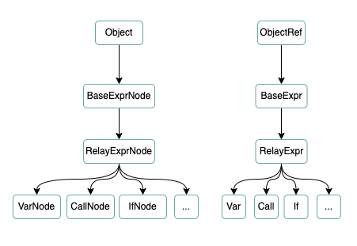
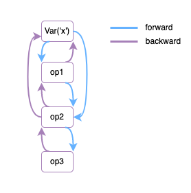

relay是如何构建一张计算图的呢？从下面的代码中可以略窥一二，首先是使用`Var`来定义计算图的输入；然后通过算子的调用如`log`、`add`等来定义算子之间的依赖；接着将输入、输出作为参数传递给`Function`来完成计算图或计算子图的定义；最后将Function传给`IRModule`做些额外的工作。

```cpp
auto tensor_type = relay::TensorType({2, 3}, DataType::Float(32));
auto x = relay::Var("x", tensor_type);
auto log_op = relay::Op::Get("log");
auto v1 = relay::Call(log_op, {x}, tvm::Attrs(), {});
auto add_op = relay::Op::Get("add");
auto v2 = relay::Call(add_op, {v1, v1}, tvm::Attrs(), {});
auto func = relay::Function(relay::FreeVars(v2), v2, relay::Type(), {});
auto mod = tvm::IRModule::FromExpr(func);
```

定义的计算图结构如下图示意



# operation算子

在介绍算子的实现之前先了解一下Object、ObjectRef类，tvm中的许多类都继承这两个类，它们实现了一些通用的函数，如unique、use_count等。这两个类的子类经常成对出现，实际上数据是存储在Object子类实例中，下面是算子类的继承关系图：



下面就详细介绍算子的实现。计算图的输入用`Var`类来表示，它一般接受两个参数：计算图输入的名称、输入的尺寸和类型。从代码中可以看到它只是存储了传入的参数而已，且存储在`VarNode`实例中。

```cpp
class Var : public Expr {
	Var(String name_hint, Type type_annotation, Span span = Span())
      : Var(Id(name_hint), type_annotation, span) {}
	Var(Id vid, Type type_annotation, Span span = Span()) {
		ObjectPtr<VarNode> n = make_object<VarNode>();
	  n->vid = std::move(vid);
	  n->type_annotation = std::move(type_annotation);
	  n->virtual_device_ = VirtualDevice::FullyUnconstrained();
	  n->span = std::move(span);
	  data_ = std::move(n);
	}
}
```

`Call`类用来调用计算函数，它接受要调用的函数和函数的输入等，它也只用来存储参数，重点是要调用的函数如`log`、`add`的实现。这些函数定义在`src/relay/op`下，下面以log为例介绍其实现：

```cpp
// 宏定义，用于注册函数
#define RELAY_REGISTER_UNARY_OP(OpName)                                        \
  TVM_REGISTER_GLOBAL("relay.op._make." OpName).set_body_typed([](Expr data) { \
    static const Op& op = Op::Get(OpName);                                     \
    return Call(op, {data}, Attrs(), {});                                      \
  });                                                                          \
  RELAY_REGISTER_OP(OpName)                                                    \
      .set_num_inputs(1)                                                       \
      .add_argument("data", "Tensor", "The input tensor.")                     \
      .add_type_rel("Identity", IdentityRel)                                   \
      .set_attr<TOpPattern>("TOpPattern", kElemWise)                           \
      .set_attr<TOpIsStateful>("TOpIsStateful", false)                         \
      .set_attr<FInferCorrectLayout>("FInferCorrectLayout", ElemwiseArbitraryLayout)
// 宏
#define RELAY_UNARY_COMPUTE(FTOPI)                        \
  [](const Attrs& attrs, const Array<te::Tensor>& inputs, \
     const Type& out_type) -> Array<te::Tensor> { return {FTOPI(inputs[0])}; }
// 函数注册
RELAY_REGISTER_UNARY_OP("log")
    .describe(R"log(x)")
    .set_support_level(1)
    .set_attr<FTVMCompute>("FTVMCompute", RELAY_UNARY_COMPUTE(topi::log));
```

使用`RELAY_REGISTER_UNARY_OP`宏将函数注册到系统中，函数的数据存储在OpRegEntry类实例中，如输入的数量、属性、描述信息等，值得注意得是函数的实现被保存到了属性中，且实现是调用的`topi::log`。topi (Tensor operator inventory，张量算子库)提供了许多内置的算子实现，其底层是通过te (Tensor Expression，张量表达式)来定义的，关于te的介绍留待后续文章，下面是topi::log的实现：

```cpp
#define TOPI_DECLARE_UNARY_OP(OpName)                                                   \
  inline Tensor OpName(const Tensor& x, std::string name = "T_" #OpName,                \
                       std::string tag = kElementWise) {                                \
    return compute(                                                                     \
        x->shape, [&](const Array<Var>& i) { return ::tvm::OpName(x(i)); }, name, tag); \
  }

TOPI_DECLARE_UNARY_OP(log);
```

# Function函数

function译作函数，但是在这里也可以叫作计算图或者计算子图。Function类通过接收输入节点和输出节点来定义计算图，另外Function还可以调用Function，因此所以说还可以称为计算子图。可以想象一下，我们在定义模型时往往会调用子模型，Function正是实现了此功能。下面来看如何使用及生成的IR：

```python
import tvm
from tvm import relay
import numpy as np

t = relay.TensorType([1, 2, 3], "float32")
x = relay.var("x", t)
y = relay.add(x, x)
func = relay.Function([x],y)

c_data = np.array([1, 2, 3]).astype("float32")
c = relay.const(c_data)
z = relay.add(func, c)

out = relay.Function([],z)
mod = tvm.IRModule.from_expr(out)
print(mod)

# relay ir
# def @main() {
#   %0 = fn (%x: Tensor[(1, 2, 3), float32]) {
#     add(%x, %x)
#   };
#   add(%0, meta[relay.Constant][0])
# }
```

# IRModule

最后一步是将function传给IRModule类，FromExpr直接调用FromExprInContext函数，因此看代码：

```cpp
std::pair<IRModule, GlobalVar> IRModule::FromExprInContext(
    const RelayExpr& expr, const tvm::Map<GlobalVar, BaseFunc>& global_funcs,
    const tvm::Map<GlobalTypeVar, TypeData>& type_definitions,
    std::unordered_set<String> import_set) {
  auto mod = IRModule(global_funcs, type_definitions, std::move(import_set));
  String gv_name;

  // 判断输入是否是Function，否则构建一个Function
  BaseFunc func;
  if (auto* func_node = expr.as<BaseFuncNode>()) {
    func = GetRef<BaseFunc>(func_node);
    if (auto opt = func->GetAttr<String>(tvm::attr::kGlobalSymbol)) {
      gv_name = opt.value();
    }
  } else {
    func = relay::Function(relay::FreeVars(expr), expr, Type(), relay::FreeTypeVars(expr, mod), {});
  }

  if (gv_name.empty()) {
    // 为Function设置一个名称
    gv_name = mod->GetUniqueName("main");
  }

  GlobalVar main_gv(gv_name);
  // func名与func一一对应，添加到module中
  mod->Add(main_gv, func);
  return {mod, main_gv};
}
```

从代码中可以看到只是简单地将function添加到module的实例中，其实这一系列的操作下来都是在构建完计算图后将其封装起来，实际对计算图进一步分析处理在后续的流程中。下面以`PrettyPrint`函数为例来说明如何从IRModule中获取计算图中的算子信息，该函数用来打印relay IR到终端，在python中使用print打印IRModule实例底层就是调用的此函数，另外还有一个类似功能的函数`AsText`，它会附加一些额外的信息。从下面代码的调用链中可以看到在PrettyPrint函数中使用PrintFinal函数，接着使用PrintMod函数从IRModule中获取Function即计算图，最终使用PrintFunc来打印计算图：

```cpp
String PrettyPrint(const ObjectRef& node) {
  Doc doc;
  doc << TextPrinter(/*show_meta_data=*/false, nullptr, false).PrintFinal(node);
  return doc.str();
}
Doc TextPrinter::PrintFinal(const ObjectRef& node) {
  Doc doc;
  if (node.defined() && node->IsInstance<IRModuleNode>()) {
    doc << PrintMod(Downcast<IRModule>(node));
  }
	...
  return doc;
}
Doc TextPrinter::PrintMod(const IRModule& mod) {
  Doc doc;
  int counter = 0;
  // 打印type definition
  ...
  // 打印functions
  std::vector<GlobalVar> vars;
  for (const auto& kv : mod->functions) {
    vars.emplace_back(kv.first);
  }
  std::sort(vars.begin(), vars.end(), [](const GlobalVar& left, const GlobalVar& right) {
    return left->name_hint < right->name_hint;
  });
  for (const auto& var : vars) {
    const BaseFunc& base_func = mod->functions[var];
    ...
    // 打印函数
    if (base_func.as<relay::FunctionNode>()) {
      std::ostringstream os;
      os << "def @" << var->name_hint;
      doc << relay_text_printer_.PrintFunc(Doc::Text(os.str()), base_func);
    }
    doc << Doc::NewLine();
  }
  return doc;
}
```

在PrintFunc中开始打印Function的信息，首先是type params，然后是参数列表，接着是属性信息、Function的返回类型，最终是Function的实现。这里值得一提得是Function类的完整定义是：

```cpp
Function(tvm::Array<Var> params, Expr body, Type ret_type, tvm::Array<TypeVar> ty_params,
         tvm::DictAttrs attrs = NullValue<DictAttrs>(), Span span = Span())
```

我们之前只使用了前面两个参数，所以并非所有的信息都打印了出来：

```cpp
Doc RelayTextPrinter::PrintFunc(const Doc& prefix, const relay::Function& fn) {
  Doc doc;
  doc << prefix;
  // 1. 打印type params
  ...
  // 2. 打印参数列表
  doc << "(";
  std::vector<Doc> params;
  for (Var param : fn->params) {
    params.push_back(AllocVar(param));
  }
  // 3. 打印attrs属性
  for (const Doc& d : PrintDictAttrs(fn->attrs)) {
    params.push_back(d);
  }
  doc << Doc::Concat(params) << ") ";
  // 4. 打印函数返回类型
  if (fn->ret_type.defined()) {
    doc << "-> " << Print(fn->ret_type) << " ";
  }
  // 5. 打印函数内部实现
  doc << PrintBody(fn->body);
  return doc;
}
```

打印函数实现由PrintBody来完成，由于调用流程比较繁琐，这里就不粘贴代码了，总的来说获取计算图中的算子信息流程是这样的：首先从计算图的输出节点开始反向追溯直到到达输入节点为止，我们知道一个算子的输入是另一个算子的输出，这样就可以反向地遍历整个计算图。如下图反向遍历：



这一过程是通过`VisitExpr`函数来完成的，它会将不同类型的算子分配到不同的`VisitExpr_`重载函数中，这样就可以分别在相应的重载函数中得到不同算子的信息。由于这个遍历计算图的机制在transform中非常重要，就留在下文详细介绍其实现原理。